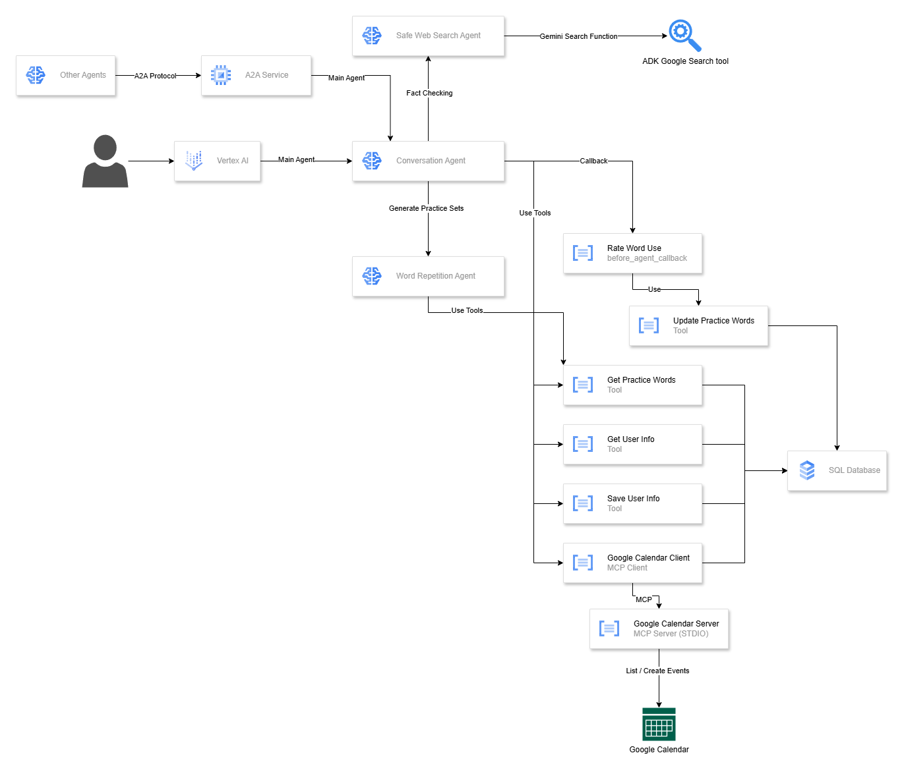
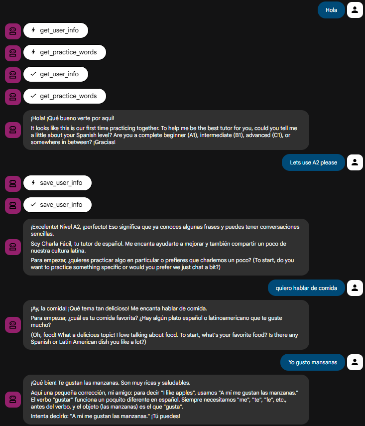
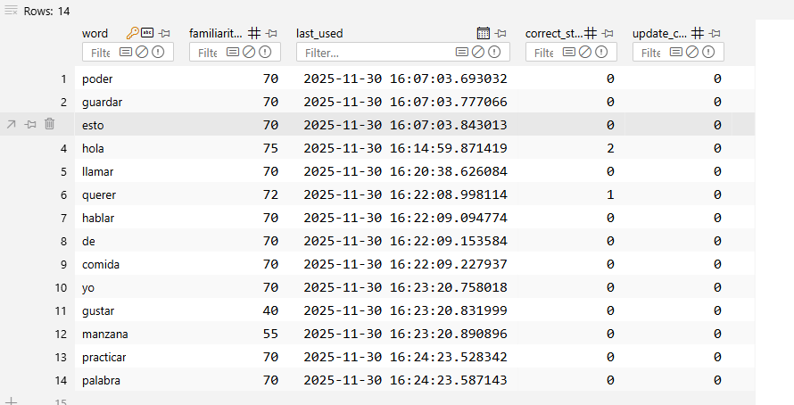
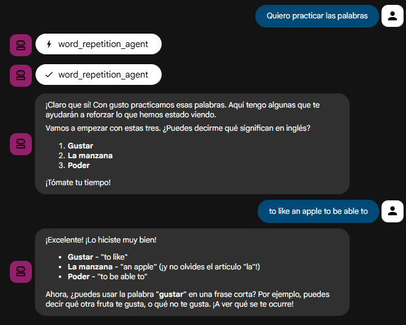
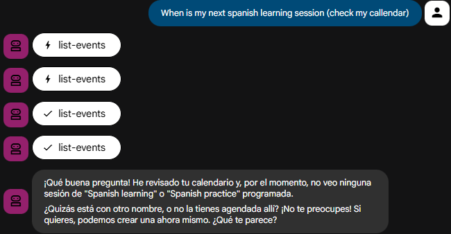
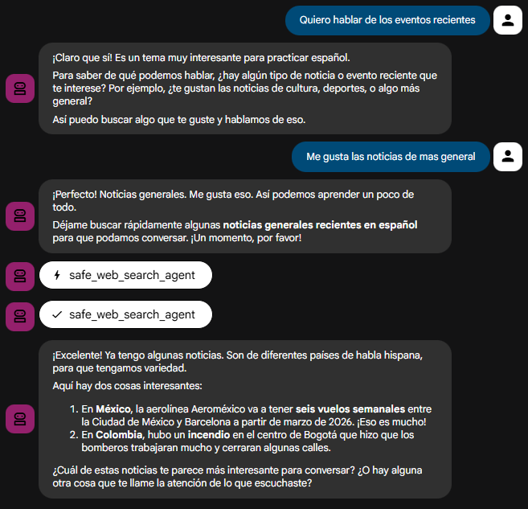

# Charla Facil

AI Spanish learning assistant.

## Features

- AI based chat solution for learning spanish.
- Multi-Agency: spearate agents for different learning experiences (word repetition, role playing, grammar review, etc..)
- Tracking and saving student profile for personalized interactions.
- Tracking and rating spanish word proficiency.
- Google callendar MCP access (for discussing future events and planning future learning sessions)
- Safe web browser capability (for fact-checking only - inapropriate and not children safe content will not be shown to the user).
- A2A compatibile.
- Ready for GCP deployment.
- Based on Gemini models and ADK framework.
- Unit tests with pytest (for tools)

## Setup

### Requirements

- `python 3.13`
- `poetry 2.1.4`

### Configure

#### Environment Variables

```sh
cp .\charla_facil\.env.example .\charla_facil\.env
code .\charla_facil\.env
# Replace __API_KEY__ with your GCP API key
```

#### Google Callendar MCP

- `cp .\charla_facil\gcp-oauth.keys.example.json .\charla_facil\gcp-oauth.keys.json`
- Follow instructions listed here - https://github.com/nspady/google-calendar-mcp?tab=readme-ov-file#google-cloud-setup to obtain client and ID secret.
- When running the chat for the first time, you'll be asked to login to your google account and grand necessary permissions to the chat. This is necessary if you want to use the Google Callendar MCP functions.

## Deploy (GCP)

- Adjust engine config at `charla_facil/.agent_engine_config.json`
- Set `GOOGLE_CLOUD_PROJECT` and `GOOGLE_CLOUD_LOCATION` in .env file.

```sh
source .env

poetry run adk deploy agent_engine --project=$GOOGLE_CLOUD_PROJECT --region=$GOOGLE_CLOUD_LOCATION charla_facil --agent_engine_config_file=charla_facil/.agent_engine_config.json
```

## Run (Local)

`poetry run adk web --log_level DEBUG`

## Agent2Agent

```sh
export GOOGLE_API_KEY="__API_KEY__" # Bash
$env:GOOGLE_API_KEY = "__API_KEY__" # Powershell
poetry run uvicorn charla_facil:a2a_app --host localhost --port 8001
# http://localhost:8001/.well-known/agent-card.json
```

## Writeup

### Problem Statement

AI Agents present a massive opportunity to personalize the user experience. They act as expert-level language tutors without needing any additional training. By combining these two capabilities, we can build a powerful solution for learning new languages.

An AI Agent provides a chat companion that can adjust its level of speech to the user, explain difficult concepts, and help identify weak spots in a student's knowledge. With the use of sophisticated tools, it can provide endless topics for discussion while keeping track of recent student struggles (specifically with words and grammar). AI will inevitably become a core human companion for learning, and this chat application is pioneering that shift.

### Why Agents?

Language learning is a dynamic process! Humans learn language best by using it in practice. This is often referred to in linguistics as the "Output Hypothesis" — the idea that you don't truly learn until you are forced to produce language yourself.

Memorizing 100 words and their inflections means nothing until the student uses them in a real-life scenario. An AI Agent is the perfect companion for this. You can treat it as a skillful and knowledgeable native-level speaker to test and expand your skills, bridging the gap between theory and actual conversation.

We chose an Agentic Architecture because a simple LLM is not enough. To truly replace a human tutor, the system needs to do more than generate text—it needs to take action.

- **Agents observe**: They analyze your messages for patterns.
- **Agents act**: They use tools to log your errors into a persistent database.
- **Agents adapt**: They change their behavior based on your history.

**This allows us to build a system that is not just a "chat," but a living learning loop.**

### What you created

An intelligent, multi-agent AI chat application based on ADK and state of the art Google Gemini models.

The core Conversation Agent manages flow, while delegating difficult tasks like quiz generation to a specialist Word Repetition Agent. This system uses a persistent memory tool to track proficiency, ensuring every interaction is targeted and effective.



### Demo

#### Regular Chat

- At the start of the conversation, the agent automatically fetches the user's **profile information** (to personalize communication) and the list of recent **word struggles** (to focus practice during the session).
- The agent asks for the **target CEFR level** for the conversation. This level is saved to the user profile and automatically reused in future sessions (the user can change it at any time).
- The AI drives the conversation with the user.
- Each user message is analyzed, and an LLM assigns a specific rating to each word. The rating scale is:
  - 0 = Did not know the word.
  - 1 = Completely wrong usage.
  - 2 = Somewhat wrong/incorrect context.
  - 3 = Correct context but misspelled/minor error.
  - 4 = Perfect usage.
- The LLM's rating dynamically updates the overall proficiency level for that given word. **Proficiency is a score between 0 and 100**. The algorithm **adjusts the word proficiency based on**:
  - The correct use streak.
  - The time elapsed since the word was last used.
- User errors are corrected in the chat flow, but the detailed word rating and proficiency updates happen in the background to avoid stressing the user.



#### Word Proficiency Sample (SQL Table)



#### Word Repetition Agent

- User may ask for word practice session.
- The job of selecting correct word and target translation is delegated to a `word-repetition-agent` sub-agent.
- Agent prioritize words that the user is struggling with and words that have not been used by the student for a while.
- User answers are rated and they contribute to the word proficiency store.



#### Google Calendar MCP

- User can use his Google Calendar integration to list and plan future learning session (events will be created by agent).
- Student can also discuss his future events with an agent (e.g. `I'm having a bussiness meeting with a client on Friday. See the meeting conspect and help me prepare for it by acting as a customer.`).
- General assistant tasks are disabled (agent will not schedule dentist appointment for you! Only tasks related to learning spanish are allowed).



#### Web Search

- The agent can fact check and discuss recent events by using a web search.
- Web search is safe - only child-friendly and appropriate use needed for learning spanish is allowed. General use web searching will not be allowed by the agent.



### The Build

Consult the architecture overview above for a complete visual representation of solution. This section focuses on technical details only.

#### Agents

- **Conversation Agent**: Main agent that keeps conversing with the user in a loop. Recommended model: `Gemini 3.0 Pro`
- **Safe Web Search Agent**: Performs safe web serach to drive conversation with a user. Separate agent adds extra control on what information can be retrieved and shown to the user. Uses ADK Google Search tool (built-in)
- **Word Repetition Agent**: Selects words to practice that the user is struggling with. This agent leverages Pydantic schemas to guarantee Structured Output (the quiz format) which the conversation agent then administers.

##### Callbacks

- **Rate Word Use**: callback that parses each input user message. Detects Spanish words (ignores English words, names of people, brands, etc..) and rates them with help of LLM (Recommended model: `Gemini 2.5 Flash`).

#### Tools

- **Get / Update Practice Word**: Stores and reads the words used by the student in an SQL database. Maintains the proficiency rating of each word.
- **Get / Save User Info**: Stores and reads user profile information in an SQL database.

##### MCP

- **[Google Calendar MCP](https://github.com/nspady/google-calendar-mcp)**: Used to plan and discuss events saved in user calendar.

#### Deployment

- **SQL Database**: Current setup uses localhost SQLLite database, in the future this could be replaced with production-grade relational database hosted in a cloud.
- **ADK Web**: Interface used for testing and development.
- **Vertex AI**: Agent can be deployed to Vertex AI for production use.
- **A2A Service**: A2A service can be started (see readme for instructions)

### If I had more time, this is what I'd do

- **More Evaluation**:
  - Since this solution is highly dynamic, formal evaluation sets were complicated. I've focused on validation of tool reliability and agent autonomy:
    - **Tool Reliability**: Confirmed the Get/Update Practice Word tool accurately reads and writes the proficiency score to the SQL database 100% of the time.
    - **Memory Recall Test**: Performed conversation sessions where the user intentionally made the same mistake twice (e.g., using estar incorrectly). The system successfully prioritized the associated word in the next requested Word Repetition Agent quiz.
    - **Safety Validation**: Tested the Safe Web Search Agent by requesting inappropriate content to ensure the safety guardrails successfully blocked or sanitized the response.
- **Gramar concepts**:
  - Rate gramar use along the word use
  - Allow practice focused on specific gramar concepts (e.g. `I want to practice future tense`)
- **Word conjugation**: this is more static exercise but could be useful (e.g. requested by agent when seeing that user is struggling with it).
- **Multimodal support**: Support speach / image use in user messages and LLM responses. This could improve learning process immensively.
- **Roleplaying**: Add separate roleplaying agent to practice specific conversation. Must include careful prompting to prevent inappropriate use.
- **Production**: obserability, scalability, token cost optimization. This is a simple PoC that did not take into consideration important production issues.
